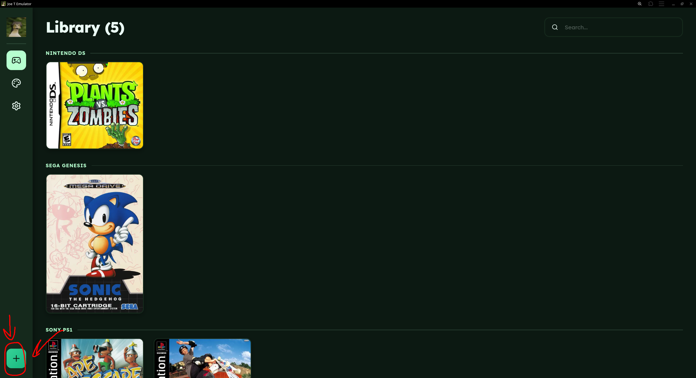
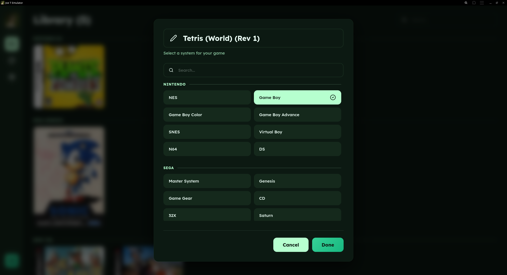
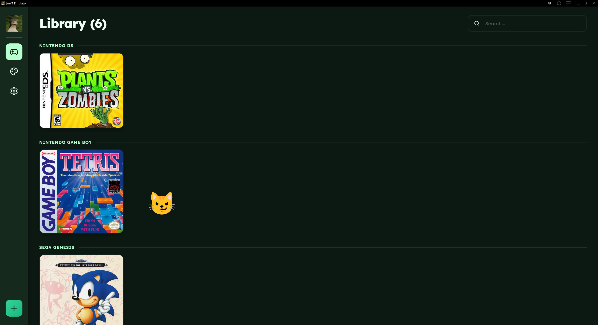

<h1>JOE T EMULATOR</h1>

<a href="https://joetemulator.netlify.app">joetemulator.netlify.app</a>

## Features

- **30+ supported systems**
- **Auto cover art** - Fetched from [thumbnails.libretro.com](https://thumbnails.libretro.com) based on hashing or the game title as a fallback
- **Completely local** - All ROMs and save states stay in your browser

## Supported Systems

| Manufacturer | Systems |
|---|---|
| Nintendo | NES, SNES, N64, Game Boy, GBC, GBA, DS, Virtual Boy |
| Sega | Master System, Genesis, Game Gear, CD, 32X, Saturn |
| Sony | PlayStation, PSP |
| Atari | 2600, 5200, 7800, Lynx, Jaguar |
| Commodore | Amiga, 64, 128, VIC-20, Plus/4, PET |
| NEC | TurboGrafx-16, PC-FX |
| Arcade | FBNeo, M.A.M.E. |
| Other | 3DO, DOS, ColecoVision, Neo Geo Pocket, WonderSwan, Intellivision |

## Adding Games

1. To add a game, click the + button in the sidebar and pick a file or multiple. In addition to this you can drag files onto the page.

2. You will be prompted to pick a system for your game(s). You can also rename the game through this menu.

3. Cover art is then fetched automatically. You can also set your own image via the context menu by right-clicking a game.

4. Play by clicking a game.

